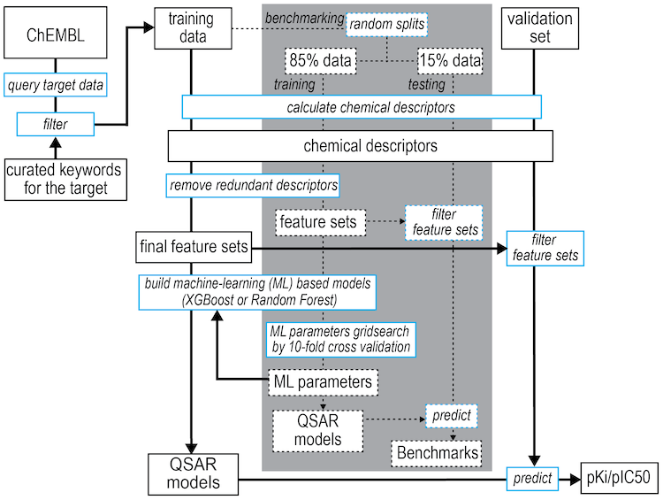

## Introduction
The code in this repository is the chemoinformatics part of our project in developing an infrastrature for counter screening small-molecule ligands for a selected target and against hERG. 
For the moment, we focus on the ligands for the dopamine transporter (DAT).  

The regression models are based on the methods found in Wacker and Noskov
[Performance of machine learning algorithms for qualitative and quantitative
prediction drug blockade of hERG1 channel](https://doi.org/10.1016/j.comtox.2017.05.001).
The classifier models were initially derived from the methods of
Siramshetty, et al [The Catch-22 of Predicting hERG Blockade Using Publicly Accessible Bioactivity Data](https://pubs.acs.org/doi/10.1021/acs.jcim.8b00150). 

The counter or synergistic screening platform can be easily adapted to identify novel compounds with desired selectivity for other targets, such as the ligands antagonizing both DAT and sigma1 receptor. 

***Our improvements***
 
Due to the stochastic element in the prediction, for regression models, we create multiple models to be used in the prediction and take the average. The classifier models were modified to use the RDKit topological
descritors rather than fingerprint descriptors derived from the Morgan Topological fingerprints.

***Workflow***

Workflow of building the machine learning based QSAR models and using them to make predictions.


## Runtime environment

These models are coded in python 3.6.4.  They were developed using RDKit version
2018.3.1, scikit-learn 0.21.1, MolVS 0.1.1, and xgboost .  Xgboost,
Scikit-learn, RDKit and prerequisites were installed from the anaconda
repository (using the channel rdkit for rdkit and its prerequisites).  MolVS
was installed under anaconda using pip.  If using a recent version of anaconda
python to build and run the models, it is probably necessary to create a virtual
environment based on python 3.6.  At present, trying to install RDKit into a
python 3.7 environment does not appear to be supported and causes anaconda to
regress the entire installation to python 2.7.  Scikit-learn is installed by
default with the full anaconda distribution (not miniconda). The commands to
install xgboost, RDKit and MolVS into an active python 3.6 virtual environment
are:
```
conda install py-xgboost
conda install -c rdkit rdkit 
#http://rdkit.org/docs/Install.html#cross-platform-under-anaconda-python-fastest-install
#just tried using conda-forge
#conda install -c conda-forge rdkit
pip install MolVS
pip install -U scikit-learn
```

### About Descriptor Generation

The 2D descriptors that are available in rdkit are referenced in Descriptors.descList.  A code snippet that will list
these descriptors at an interactive python prompt is:
```
from rdkit.Chem import Descriptors
for foo in Descriptors.descList:
    print(foo[0])
```

### Strucure of the repository
The major scripts are in core directory. The unittest is included in core. An example of running the production run can 
be run in "example" (see README.md in example). 

    hERGvDAT
    ├── core            <-- major scripts (& unittest included)
    ├── example         <-- example of running filters/buildmodels/prediction
    └── README.md

### unittest
To run the unittest, please do this in to the root diectory. There are 19 defined functions in filters.py. The 
unittest_filters.py cover 15 functions, and some file output funcation (write_smi_act_reg 
and write_smi_act_class) and simple routien calculation (add_doc_cmpd_cunt and calc_pscale) are excluded. There are 
20 defined functions in unittest_buildmodel.py. The unittest cover 17 functions, 
and 3 functions (MSE, R2, and RMSE) for some routine calculation are excluded.

    # unittest for filters.py
    python -m unittest -v core/unittest_filters.py -b

    # unittest for buildmodel.py
    python -m unittest -v core/unittest_buildmodel.py -b

### example
#### 1. Datasets (data_sql) provided in this example
Dataset provide in data_sql fodler

        data_sql
        ├── DAT
        │   ├── chembl25_homo.tsv			<-- dataset for human DAT
        │   ├── chembl25_rat.tsv			<-- dataset for rat DAT
        │   ├── chembl25_raw.tsv
        │   ├── chembl25.sql			<-- sql
        │   └── chembl25.tsv			<-- dataset for all DAT
        └── hERG
            ├── chembl25_raw.tsv
            ├── chembl25.sql                        <-- sql
            └── chembl25.tsv			<-- dataset for hERG

***Steps to generate initial ChEMBL dataset from our inhouse sql server***

Use psql and chembl25_Classifier.sql to generate chembl25_Classifier_raw.tsv
   
    # You would need the chembl password for running our inhouse sql server. Please ask the admin for the password.   
    /usr/pgsql-9.6/bin/psql -h 127.0.0.1 chembl_25 chembl  --field-separator=$'\t'  --no-align -f chembl25_Classifier.sql -o chembl25_Classifier_raw.tsv

Clean up the tsv file. remove the header and the last line of the file

    sed '1d;$d' chembl25_Classifier_raw.tsv > chembl25_Classifier.tsv

Extract human/rat bioactivity for DAT

    cat chembl25_Classifier.tsv | awk '$3=="Homo" {print}' > chembl25_Classifier_homo.tsv
    cat chembl25_Classifier.tsv | awk '$3=="Rattus" {print}' > chembl25_Classifier_rat.tsv

#### 2. Examples of running filters and buildmodels
All output files in the example can be found in output. 

Load python modules. Note that you would need to have necessary modules installed in your python environment.  

    module load python

defince COREPATH

    COREPATH="/path/to/core/dir"

An example of running filters

    python ${COREPATH}/run_filters.py -p DAT -t data_sql/DAT/chembl25.tsv -a inhibitor -o dataset_all_DAT_inhibitor -b pubdata -s Ki | tee dataset_all_DAT_inhibitor_Ki.log


There are four files are required in our code. AmyCompounds.act/AmyCompounds.smi are used for excluded validation coumpounds from the traning dataset. 
That ensure the validation set is not used during the training.  "to_change.txt" is used for correcting the bio-activity data. "to_remove.txt" is used 
to remove obvious problematic compounds from the training dataset. In this example, we simple touch those files without any modification. 

    touch dataset_all_DAT_inhibitor/AmyCompounds.act
    touch dataset_all_DAT_inhibitor/AmyCompounds.smi
    touch dataset_all_DAT_inhibitor/to_change.txt
    touch dataset_all_DAT_inhibitor/to_remove.txt

An example of running buildmodels

    python ${COREPATH}/run_buildmodel.py -s buildmodel -m reg -x xgb   -t 0.15 -r 1 -n 1 -i dataset_all_DAT_inhibitor_Ki/pubdata

An example of making prediction

    # generate testing compounds for example prediction
    head -n 10 dataset_all_DAT_inhibitor_Ki/pubdata.smi > testcoumpounds.smi

    # run prediction
    python $COREPATH/run_buildmodel.py -s prediction -m reg -x xgb   -t 0.15 -r 1 -n 1 -d ./testcoumpounds


#### 3. Usage of run_filters.py & run_buildmodel.py
run_filters.py and run_buildmodel.py are wrappers for filters.py and buildmodel.py 
***run_filters.py***

    python ${COREPATH}/run_filters.py -help

    run_filters.py -t <tsv_file>  -p <target_protein> -a <assaydefinition> -o <output_dir> -b <output_file_basename> -s <standard_type>

***run_buildmodel.py***

    python ${COREPATH}/run_buildmodel.py -help
    
    run_buildmodel.py 
            
            -s <stage>              buildmodel, prediction, or both
            -m <model>              regression or classification model
            -x <method>             xgb or rf (random forest) machine learning methods
            -t <testing_percent>    proportion of dataset to reserve for testing; decimal range [0,1)
            -r <random_state>       number of random states/seeds to use to build the model; int range [1,inf)
            -n <num_splits>         number of times to randomly split your data into a testing set; int range [1,inf)
            -i <input_basename>     location of your input data with its basename (without ext ex. .act or .smi)
            -d <validation_data>    dataset used to benchmark the model prediction
    
            If -t is set to 0, then -n must be set to 1 as there is only one way to split the data into 100% training
            and 0% testing data. If -n is greater than 1, then -t must be in range (0,1).
            
            If stage is set to do prediction then -d <validation_data> must also be given. Can input nothing for -d if build
            model.


## Contributors
* Andrew Fant 
* Joslyn Jung
* Andy Guan
* Kuo Hao Lee
* Lei Shi*  


